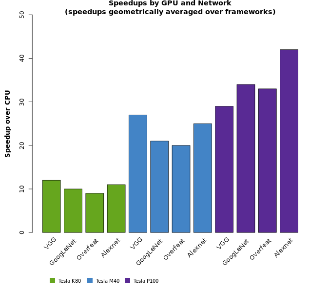

Amazon Web Services (AWS) 上和 阿里云 GN5 规格比较接近的是 [P2](https://aws.amazon.com/ec2/instance-types/p2/) 实例。其使用的是 NVidia Tesla K80 显卡。

从下图不难看出， GN5 目前使用的 P100 显卡

当然 AWS 作为云计算业界的标杆， 自然也有其优势的地方:

- AWS 的竞价实例模式(Spot Instances) 已经推出很久了， 其价格已趋于稳定， 基本没有大的波动。 而阿里云一些区域的价格波动幅度还是很大的。你可能会迫于价格，花更多时间精力在在个区域间来回迁移。
- 如果要在不同的区域间迁移实例， AWS 上会更加简单。
- AWS EC2 实例在停机后就只收取磁盘费用， 而阿里云要在实例删除后才停止收费。
- AWS 还提供了 Amazon Machine Image (AMI)， 即专为机器学习定制的系统镜像， 简化了 NVidia 驱动和 CUDA 的安装。而且
