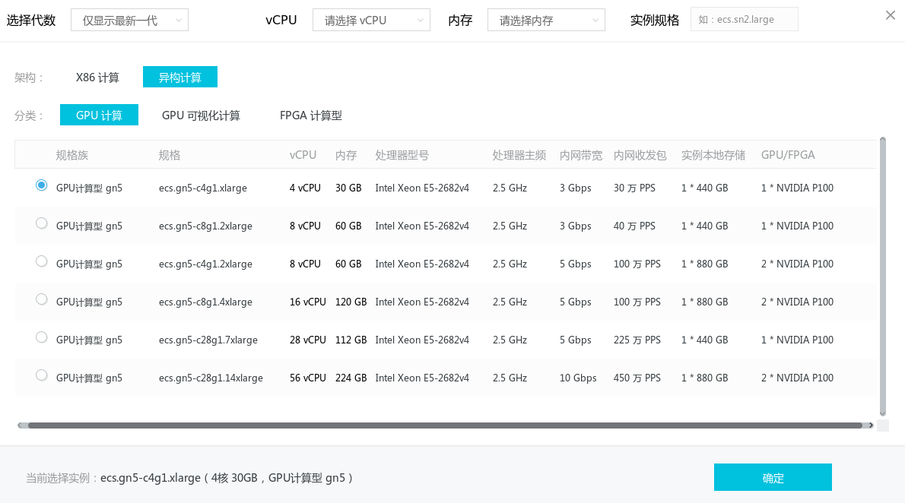
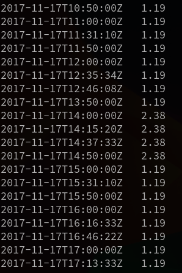

### 实例类型的选择
ECS 支持多种不同类型的实例， 但其中大部分并不适合用来跑机器学习。即便是那些被归类为计算型(即ecs.sn1)的主机, 也只是CPU比较强劲，用来做深入学习并没有多大优势。

在阿里云上。真正适合跑深度学习的主机是被归类在**异构计算**这个类别下。 这类主机不仅 CPU, 内存配置较高， 还搭载了性能强劲的<del>战术核</del>显卡, 非常适合用来做深度学习。 这其中又以 *GN5* 型最适合个人开发者(其实 GN4 也不错， 但现在基本买不到 GN4型的主机了)。

以 GN5 系列里配置最低的规格 *ecs.gn5-c4g1.xlarge* 为例， 它配备了4*2.5GHz的 CPU, 30G 内存 和 1块 NVIDIA P100 GPU。

在 **计费方式** 方面， 强烈推荐使用**竞价实例** 这一付费方式。 以*美国西部1区* 的 *ecs.gn5-c4g1.xlarge* 为例， 若使用按量付费模式， 每小时的价格为 ￥11.916， 而竞价实例模式， 每小时的价格尽为 ￥1.224。(注: 实例的价格会不断浮动， 请以阿里云官网的实时价格为准) 差别感人。

至于实例所属的**地域**， 建议选择**国外**。 由于不可描述的原因， 机器学习常用到的一些库， 数据集， 在国内网络下无法下载或下载速度极慢。 使用国外的主机可以直接规避这些问题。

## 挑选价格最低的区域
竞价实例的价格是波动的， 而且不同区域差别较大。 鉴于本教程的使用者大多还是以学习、实验和参加 Kaggle 之类的竞赛为主， 而不是用来跑实际的业务， 因此对实例所属的地理区域不是很敏感。 那么选择价格最低的区域一般是没错的。 本项目提供个了几个工具来帮你更好地选择阿里云实例的区域i:

`price_by_region.py` 会以表格的形式列出阿里云所有区域内，各种 GPU 实例当前的价格。

你还可以运行 `price_history.py` 来查看指定区域里 30天内的实例价格的历史， 如果你看中的区域近期价格比较稳定的话， 就可以放心入手了。

