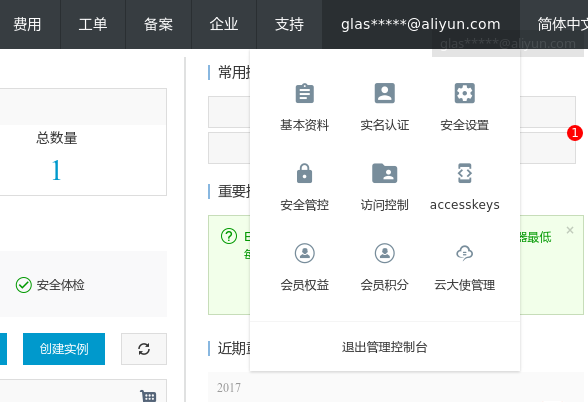
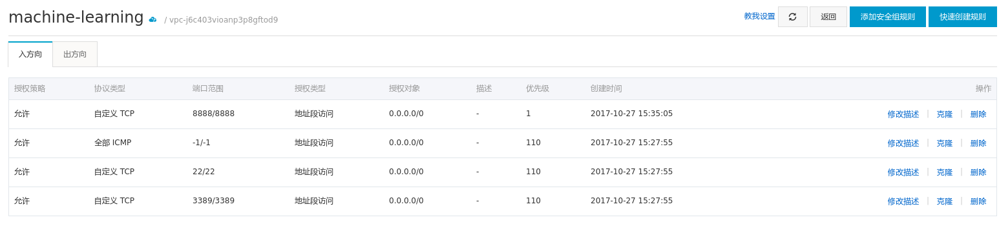

在开始前， 还有些准备工作要做。 首先， 请确保你的阿里云账户余额大于 100元， 否则你将无法购买竞价实例。

### 配置 阿里云 access key
出于安全考虑, 本项目不会把阿里云的 Access ID 和 Access Key 保存到配置文件里去, 如果你不想要在每次创建/删除实例时手动输入密码, 可以将 access key设置在 `ALIYUN_ACCESS_KEY_ID` 和 `ALIYUN_ACCESS_KEY_SECRET` 两个环境变量里。

至于如何获取access key, 可以参考这篇教程: [如何获取Access ID和Access Key](https://help.aliyun.com/knowledge_detail/38738.html)

### 创建安全组

阿里云的默认安全组规则只开放了 22 和 3389 端口访问。 为了通过公网访问 Jupyter Notebook, 至少还需要再开放一个端口， 本项目里 Notebook 使用的是 8888 端口。

你需要进入阿里云的管理控制台， 创建一个新的安全组， 然后添加一条*入方向*的安全规则 。 *端口范围* 为 `8888/8888`。 *授权对象*为 `0.0.0.0/0`。 具体步骤可以参考这个教程: [添加安全组规则](https://help.aliyun.com/document_detail/25471.html)

注意: 安全组是和阿里云的[地域](https://help.aliyun.com/document_detail/40654.html?spm=5176.doc53090.2.9.sHPohS)绑定的, 香港的 ECS 只能使用香港的安全组, 不能使用美国的安全组.

### 添加 SSH Key
你还需要在阿里云控制台导入你本机的 SSH 公钥(一般为 ~/.ssh/id_rsa.pub)。 具体步骤可以参考这个教程: [导入 SSH 密钥对](https://help.aliyun.com/document_detail/51794.html?spm=5176.doc25471.6.706.Jn8xir)

本项目的自动化脚本在创建实例时， 会选择你所指定的 SSH key。 实例创建完成后， 就能通过 ssh 登录到主机了。

### 添加 Git(SSH) Key
你需要在 `playbook/tools/files/` 目录下添加一对 SSH 公私钥。 这对公钥主要是为了方便向 Github 上 push。

### 磁盘和快照
ECS 实例会自带一块系统盘和数据盘， 但这两块盘会随着ECS实例的删除而被同时释放。 为了持久化数据， 我采用的是再额外挂载一块数据盘的方式。 这块数据盘可以独立于ECS实例存在。 平时的操作都应在这块磁盘上进行（挂载在 `/mnt/ml` 目录下）。

当然， 你还可以把这块数据盘保存为快照来进一步节省费用。
运行 `start_instance.py` 时，在交互模式下， 你有3种选项可以选择:
1. 创建一块全新的数据盘(一般只有首次运行时， 才会用到)
2. 使用一块现有的数据盘(会列出你账户下所有的数据盘，供你选择)
3. 使用一个现有的磁盘快照来创建一个新的数据盘(会给出你的快照列表)
类似的， 在运行 `delete_instance.py` 销毁实例时， 你可以选择是否为当前的数据盘创建快照?

### Jupyter Notebook
本项目默认的 Jupyter Notebook 端口为 8888。 为了安全， Notebook 只开放了通过 https 的方式来访问, 即 `https://<公网 ip>:8888/`。 由于 HTTPS 使用的是自签名证书， 首次访问时，浏览器会有相应的警告。

Jupyter Notebook 应当被配置为通过密码认证后才能访问。`playbook/roles/libs/files/` 目录下有个 `jupyter_notebook_config.py.example`样例配置文件。 将这个文件重命名为 `jupyter_notebook_config.py`, **并替换其中的密码哈希**即可。 你可以参考 Jupyter 文档 [Preparing a hashed password](http://jupyter-notebook.readthedocs.io/en/stable/public_server.html#Preparing-a-hashed-password) 来设置你自己的哈希。注意，尽管 `jupyter_notebook_config.py` 里的密码是哈希过的， 你仍然应避免把它泄漏给其他人， 事实上， 本项目已经把 它加入到 .gitignore 中了。